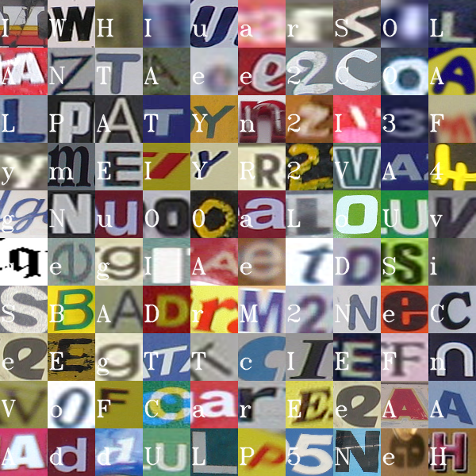
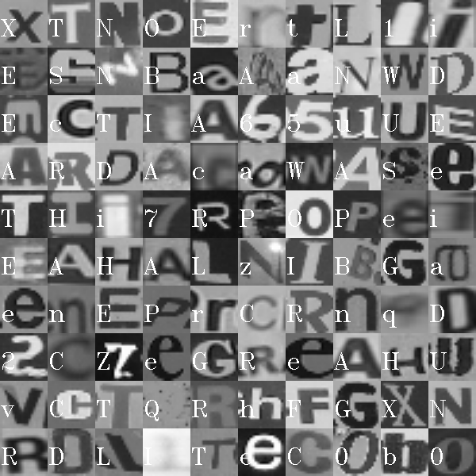

# chars74k_nsr
Classifying characters from Google Street View images taken from chars74k dataset.

This is submitted as project for [EE660 Course](https://classes.usc.edu/term-20153/course/ee-660/).
This code is also used for [kaggle](https://www.kaggle.com/naveensr89) competition. 

## Visualization
Few input images with their labels overalyed.

Grayscale images used for training.

